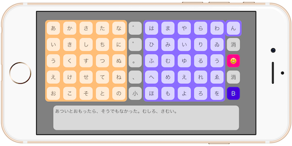

# MagicEdit
  
This is a Japanese-only character input app.  
MagicEdit works with MysticSD. (or It can also be used without MysticSD.)

## Usage
1. Move the pointer by tilting the MysticSD(controller) to the left, right, up, and down.
2. Character is entered by controller keeping several seconds the tilt. (or You push button.)
3. Using the read-aloud button, it reads the input characters.

## Install
~~1. Create a new project using Xcode. (Name is MagicEdit.)~~  
~~2. Save the contents of the MagicEdit folder.~~  
1. This repository clone  
2. Open project file

## Development
AkkeyLab  
HP:akkeylab.com

## Licence
MIT License  
Please read the LICENSE file.